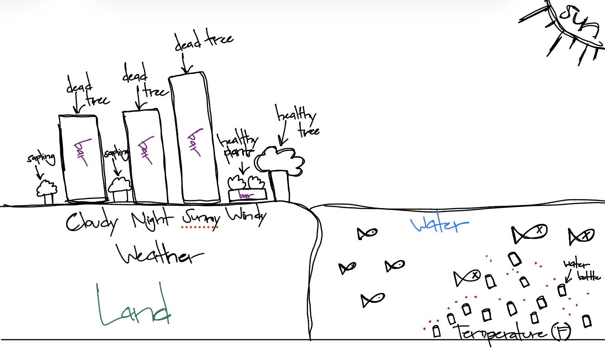
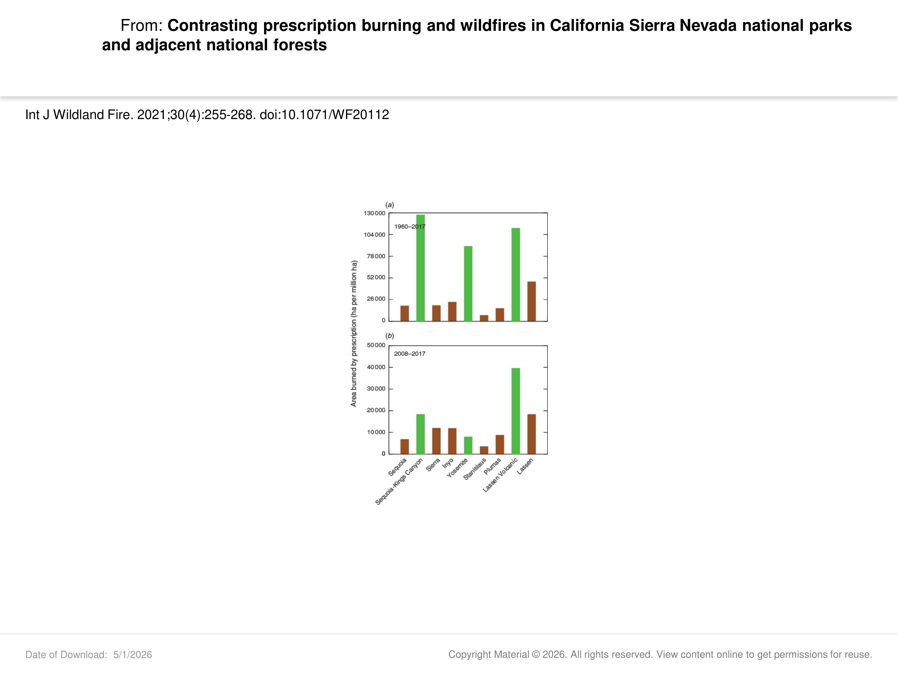

# Homework set up

```{r}

#read in packages
library(tidyverse)
library(here)
library(janitor)
library(readxl)
library(ggplot2)
library(ggeffects)
library(flextable)
library(here)
#stored kelp data as an object called kelp
kelp <- read_csv(here("data", "temp-kelp.csv"))
#stored personal data as an object called personal
personal <- read_csv(here("data", "personal_data.csv"))

```

# Problem 1. Giant kelp fronds 

## a. An appropriate test

To determine the strength of the relationship between temperature and giant kelp frond elongation, you need to conduct a Pearson's correlation test and Spearman rank correlation test.  A Pearson's correlation test is a parametric test that analyzes a linear relationship between continuous variables that are normally distributed (debatable).  On the other hand, a Spearman rank correlation test is the non-parametric version that looks as a monotonic relationship between variables that have independently observed samples.  

## b. Create a visualization

```{r}

#base layer: ggplot
ggplot(data = kelp,
#x-axis: temperature, y-axis: kelp elongation rate       
       mapping = aes(x = temp_c,
                     y = kelp_elong)) + 
#first layer: geom_point
  geom_point(color = "darkgreen") + #changed color of points to dark green
#renamed x- and y-axes and added units  
  labs(x = "Temperature (\u00B0C)",
       y = "Kelp Elongation Rate (cm/day)") +
#changed theme from default  
  theme_minimal()

```

## c. Check your assumptions and run your test

### QQ plot figure for temperature

```{r}

#base layer: ggplot with starting data frame
ggplot(data = kelp,
#y-axis for QQ plot (no x-axis)
aes(sample = temp_c)) +
#first layer: QQ reference line colored red
geom_qq_line(color = "red") +
#second layer: QQ plot
geom_qq() 

```

### QQ plot figure for giant kelp frond elongation rate

```{r}

#base layer: ggplot with starting data frame
ggplot(data = kelp,
#y-axis for QQ plot (no x-axis)
aes(sample = kelp_elong)) +
#first layer: QQ reference line colored red
geom_qq_line(color = "red") +
#second layer: QQ plot
geom_qq() 

```

### Evaluating Pearson's correlation test assumptions

By making QQ plots for each of the two variables, we were able to interpret if the variables, respectively, are normally distributed.  Looking at both QQ plots, temperature (Celsius) and giant kelp frond elongation rate (cm/day) look normally distributed as most of the points roughly follow the reference line in each plot.  For the other three assumptions, there does seem to be a linear (negative) relationship between the variables based on the scatterplot, the variables are definitely continuous, and we can give the benefit of the doubt that the data were collected through independent observations.    

### Pearson's correlation test code chunk

```{r}

#ran a correlation test between temperature and kelp elongation rate
cor.test(kelp$kelp_elong, kelp$temp_c,
#used Pearson's r correlation test as our method         
         method = "pearson")

```

## d. Results communication

To evaluate the strength of the relationship between temperature and giant kelp frond elongation rate, I used a Pearson's correlation test since each of the variables has a roughly normal distribution, the variables are continuous, and the sample size is large (n > 30).  We found a moderate negative relationship between temperature (Celsius) and giant kelp frond elongation rate (cm/day) (Pearson's r = -0.69, t(30) = -5.19, p < 0.0001, $\alpha$ = 0.05).

## e. Test implications

Giant kelp seems to grow faster in cooler temperatures as our data seems to suggest that as the temperature (Celsius) increases, the elongation rate (cm/day) of giant kelp frond elongation rate slows down.  In other words, the highest elongation rates were found in the coolest temperatures recorded whereas the slowest elongatin rates were found in the highest temperatures recorded.  Therefore, giant kelp health is most likely better maintained in temperatures that are not as warm since it would help with their frond elongation to continue growing at a higher rate.   

## f. Double check your own work

```{r}

#ran a correlation test between temperature and kelp elongation rate
cor.test(kelp$kelp_elong, kelp$temp_c,
#used Spearman rank correlation test as our method         
         method = "spearman", 
#set exact equal to FALSE to allow approximation
exact = FALSE)

```

The Pearson's correlation and Spearman rank correlation tests would have led us to the same decision about the null hypothesis as the p-values for both are less than our significance level of 0.05, which means we can reject the null hypothesis.  Therefore, there does seem to be a relationship between between temperature (Celsius) and giant kelp frond elongation rate (cm/day).  The Spearman rank correlation value was roughly -0.69, so there seems to be a a moderate negative relationship between temperature (Celsius) and giant kelp frond elongation rate (cm/day) (Spearman $\rho$ = -0.69, S = 9216, p < 0.0001, $\alpha$ = 0.05).  Similarly, the Pearson's correlation value was roughly -0.69, so the effect size seems to be moderate for the negative relationship between temperature (Celsius) and giant kelp frond elongation rate (cm/day) (Pearson's r = -0.69, t(30) = -5.19, p < 0.0001, $\alpha$ = 0.05) when conducting a Pearson's correlation test as well.  

# Problem 2. Personal data

## a. Updating your visualizations

```{r}

#created new object from personal
personal_clean <- personal |>
#cleaned column names    
  clean_names() |> 
#mutated the existing weather column  
  mutate(weather = case_when(
#filled in Sunny to replace sunny    
    weather == "sunny"  ~ "Sunny",
#filled in Cloudy to replace cloudy    
    weather == "cloudy" ~ "Cloudy",
#filled in Windy to replace windy    
    weather == "windy"  ~ "Windy",
#filled in Night to replace night    
    weather == "night"  ~ "Night"))

```

```{r}

#base layer: ggplot with x-axis
ggplot(data = personal_clean, 
#x-axis is weather and y-axis is frequency of refilling water bottle       
       mapping = aes(x = weather)) +
#changed bar colors for all weather types   
  geom_bar(fill = "navyblue") +
#changed the label for x-axis: Weather 
  labs(x = "Weather",
#changed the label for y-axis: Frequency of Refilling Water Bottle        
       y = "Frequency of Refilling Water Bottle",
#added a title to the bar chart        
       title = "Frequency of Refilling Water Bottle Based on Weather",
#added a subtitle
subtitle = "27 May 2026") +
#used a different theme from default  
  theme_minimal() +
#removed panel background  
  theme(panel.background = element_blank()) + 
#removed major and minor gridlines   
  theme(panel.grid.major = element_blank(),
        panel.grid.minor = element_blank()) 

```

```{r}

#base layer: ggplot
ggplot(data = personal_clean, 
#x-axis: temperature (Fahrenheit)
       mapping = aes(x = temperature_f)) +
#develops a scatterplot for frequency response variables, which can have colors
  geom_point(stat = "count", color = "darkred", size = 1) + 
#relabel x- and y-axes, added a subtitle
  labs(x = "Temperature (°F)",
       y = "Frequency of Refilling Water Bottle",
       subtitle = "27 May 2026") + 
#changed theme from default  
  theme_minimal()+
#removed panel background  
  theme(panel.background = element_blank()) + 
#removed major and minor gridlines   
  theme(panel.grid.major = element_blank(),
        panel.grid.minor = element_blank()) 

```

## b. Captions

**Figure 1.  Number of times water bottle is refilled depending on weather.**  Each bar (dark blue) represents frequency of water bottle being refilled every day from weeks 4-9 based on four weather categories: Cloudy, Night, Sunny, and Windy.       

**Figure 2.  Number of times water bottle is refilled based on temperature.**  Points (dark red circles) represent frequency of water bottle being refilled at a specified temperature every day from weeks 4-9.       

# Problem 3. Affective visualization

## a. Describe your personal affective visualization 

For my affective visualization, I want to make it relatable to how water consumption by humans can negative affect the environment.  In order to do that, I plan to use my bar chart distribution as the background for how terrestrial life can slowly deteriorate when people use up water from natural environments.  The higher parts of the distribution can blend into parts of the background that are a lot less green, symbolism to higher water bottle refill frequency.  For my scatterplot though, I want to use it underwater in my visualization where every part underneath the highest points in the graph will be littered with plastic water bottles. The imagery here could be that the points of highest water bottle refills will have the most plastic water bottles in my visualization, a symbolism to the litter we have in our world's waters.  

## b. Create a sketch of your idea



## c. Make a draft of your visualization


## d. Write an artist statement 

For my visualization, I am trying to show the reality of what happens when we ignore the consequences of protecting the health of the natural environment through pollution and overharvesting.  I would say the main influence of my piece is just the idea of realism where we document the the environment as it really is instead of glorifying it as some sort of separate entity from the urban world.  I decided to make my visualization digitally but drew it out myself, highlighting the two plots I made as the dead trees represent my bar chart and the plastic bottles flowing in the water are the points in my scatterplot.  

## e. Prep your materials to share in class

[View Slides](https://docs.google.com/presentation/d/1UBWH2dUcW3ISNgImpY5vJY3ra7BDg0eoF2FtFQj7Jqw/edit?slide=id.g3e561da4f6a_0_0#slide=id.g3e561da4f6a_0_0)

# Problem 4. Statistical critique

## a. Revisit and summarize

The name of the test I selected was an analysis of variance (ANOVA).  The response variable is a unit, which is represented by 9 values where 3 are NPS parks in the Sierra Nevadas and the remaining 6 are USFS forests next to those parks.  The predictor variable is the area burned, in hectares, by prescribed wildfires meant for suppression or resource benefits.



## b. Visual clarity

The authors were relatively clear in visually representing their statistics in the figures as I could analyze where each bar fell on the y-axis relative to their label on their x-axis and the colors separated the type of sites that they looked at.  Each of the labels on the x-axis were long, so they did a really good job in angling it, so each name could be legible to the reader.  However, they did not show any summary statistics or model predictions.   

## c. Aesthetic clarity

I think the authors only did an okay job at handling the visual clutter because although they managed to remove the gridlines or most likely used a minimal theme, the numbers on the y-axis could have been reduced to an easier unit to read.  In addition, the years for when the data was being recorded literally overlaps with one of the bars in the chart.  Therefore, I would say the data:ink ratio is not very high as there is lots of wording as well, which is reasonable though since there are 9 bars total in the charts.

## d. Recommendations 

Something I would change to the figure is to move the years for when the data was recorded to another part of the figure or even outside of it as it overlaps with one of the bars, which does not contribute to the legibility of the figure.  Furthermore, I would reduce the units for the response variable even further so that the numbers on the y-axis would have less zeros, reducing the about of ink that is on the figure.  The authors may have added the summary statistics or model predictions separately in another part of the paper, but if that was not the case, I would probably add that in this case to help us understand any important values.